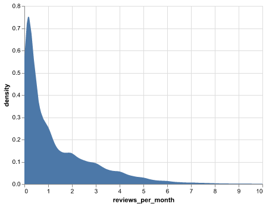
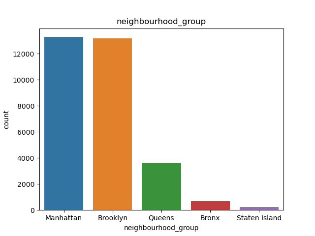
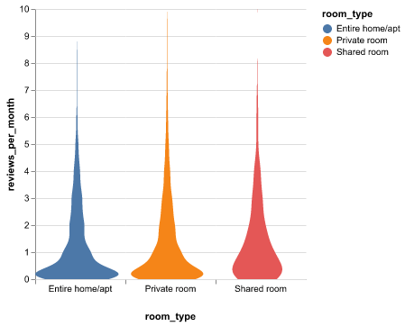
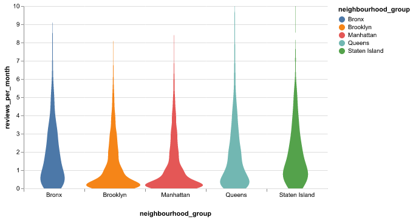

```{r setup, include=FALSE}
knitr::opts_chunk$set(echo = FALSE)
library(knitr)
library(kableExtra)
library(tidyverse)
library(readr)
```

```{r load model results, echo=FALSE, message=FALSE, warning=FALSE}
allmodel_train_results <- read_csv("../results/allmodel_train_results.csv")
best_parameters_lgbm <- read_csv("../results/best_parameters_lgbm.csv")
lgbmregressor_training_results <- read_csv("../results/lgbmregressor_training_results.csv")
final_lgbm_scores <- read_csv("../results/model_scores.csv")
```

# Summary

In this project we tested multiple Machine Learning models of the data set of NYC Airbnb listings to predict the listing popularity. The reviews per month column from the data set was used as a proxy indicator of the popularity of the listing. This is a major assumption made to work with the available data on this project. The significance of this project lies in the possibility that with a reliable Machine Learning model, we can determine the parameters that influence popularity of an Airbnb Ad. This can help the Airbnb hosts to write effective Ads. It will help the Airbnb company to work towards increasing the number of hosts that can meet these parameters. Thus AirBNB could us the study to revitalize its business model by focusing attention on selective and promising listings. It will also enable the users/renters to have a more positive experience in using Airbnb.

We found the best performing Model to be the ensemble model LGBM (Light Gradient Boosted Machine). It achieved an R2 score of `r round(final_lgbm_scores$Score[2],2)` on the test (unseen) data. This metric ranges from 0 (random model) to 1 (perfect model). Thus our model performs reasonably well and there is scope for further improvment.

Key inferences were made from the feature importance interpretation on the final model. To increase popularity, Airbnb could look into promoting hosts :- 
a. who are available for more days during the year.
b. who allow larger number of subsequent nights for booking. 


# Introduction

Since 2008, guests and hosts have used Airbnb to expand on traveling possibilities and present more unique, personalized way of experiencing the world. The inspiration behind the data set as mentioned in the Kaggle website it to understand about the different hosts and areas, draw inferences from the predictions, identify key characteristics of the hosts etc. This project develops in these inspirations and provide such inferences as a key takeaway. 

# Methods

## Data
The data set used in this project contains parameters regarding the Airbnb listings in the NYC area collected from 2019. These include attributes of the host such as their `host_id`, `host_name`, `calculated_host_listings_count`, geographical attributes such as `latitude` and `longitude` of location, `neighbourhood` etc. as well as ad attributes such as `room_type`, `price`, `minimum_nights`, `number_of_reviews` and so on. It was sourced from the Kaggle.com [**TBD**] and can be found [here](https://www.kaggle.com/datasets/dgomonov/new-york-city-airbnb-open-data). Each row in the data set represents the attributes of a specific ad listing in the NYC area.

## Exploratory Data Analysis (EDA)

Understanding the data is essential to leverage it towards building effective models. With this in mind, we commenced the project with preliminary EDA. The distribution of target variable `reviews per month` was plotted and it reveal a heavily skewed distribution. The transformation of the target variable could help in analyzing with linear models, however this was not investigated further in our project.

```{r distribution reviews per month, echo=FALSE, fig.cap="Figure 1. Distribution of reviews per month.", out.width="50%", fig.align = 'center'}

```

The barplots of the categorical features shows the imbalance in distribution between the different categories.

```{r barplot room type, echo=FALSE, fig.cap="Figure 2. Barplot of room type.", out.width="50%", fig.align = 'center'}
knitr::include_graphics("../results/count_barplot_room_type.png")
```

```{r barplot neighbourhood group, echo=FALSE, fig.cap="Figure 3. count_barplot_neighbourhood_group", out.width="50%", fig.align = 'center'}

```

The distribution of the target variable by the category types shows a similar skewness across the categories. 

```{r distribution reviews per month by room type, echo=FALSE, fig.cap="Figure 4. Distribution of reviews per month by room type.", out.width="50%", fig.align = 'center'}

```

```{r distribution reviews per month by neighbouhood, echo=FALSE, fig.cap="Figure 5. Distribution of reviews per month by room type.", out.width="50%", fig.align = 'center'}

```
We can infer that, shared room type appears to be getting more or atleast 1 review per month. Other room types have a fatter base on
the violin plot indicating that their reviews per month are close to 0. Perhaps with shared members there is
greater possibility that atleast one person will leave a review.

We derived new features and transformed existing ones to more usable forms. For example, the `last_review` data feature was transformed to equivalent numeric count indicating of `days_since_last_review`. Furthermore, features that were very specific to a listing such as `host_id` were dropped as they would lead to overfitting on the train data. For more details please refer the EDA report linked above.

A correlation plot was made on the finalized features to get some insights into the features that are most linearly related to the target variable. We have to remember that Pearsons correlation depicted here is only an indicator of linear relationship and tells us nothing about possible non linear relationships.

```{r correlation plot, echo=FALSE, fig.cap="Figure 6. Correlation of features.", out.width="100%", fig.align = 'center'}
knitr::include_graphics("../results/correlation_plot.png")
```

## Analysis

Sentiment Analysis was performed on the reviews to generate new features. The features were scaled, transformed and split into train and test data. The train data set was used for training, cross validation and model selection. The test data was used to finally assess the performance of the best model discovered. The relationship between the features and the target variable `reviews_per_month` is inherently non-linear. This intuition was investigated by using linear models such as RidgeCV, Lasso and LinearRegressor. The analysis progresses to next stage with the usage of Decision Trees, Random Forests and Ensemble models. The ensemble models experimented with include, Gradient Boosting, LGBM and XGBoost. 
Hyperparameter tuning was performed for the best performing model.
The R and Python programming languages [@R; @Python] and the following R and Python packages were used to perform the analysis: docopt [@docopt], knitr [@knitr], tidyverse [@tidyverse], docopt [@docoptpython], os [@Python], Pandas [@mckinney-proc-scipy-2010]. The code used to perform the analysis and create this report can be found [here](https://github.com/ranjitprakash1986/NYC_Airbnb_popularity).

# Results & Discussion

The linear models did not perform well as per the initial intuition. The R-squared score for the best performing linear model was `r allmodel_train_results$test_score[2]` for **inline modelname**. The non-linear models performed much better than the linear models. The Decision Tree model is overfitting with a perfect train score of `r allmodel_train_results$train_score[4]` and a poor validation score of `r allmodel_train_results$test_score[4]`. The Random forest model performed well however it still suffered from overfitting with a train_score of `r allmodel_train_results$train_score[5]`. Gradient Boosting Maching model adds base learners sequentially to progressively reduce errors in the model. It performed well and the train and validation scores have low difference. The overall validation score is a decent `r allmodel_train_results$test_score[6]`.
Light Gradient Boosting Machine (LGBM) is a faster implementation of Gradient Boosting. This is evident from the dramatically smaller fit time `r allmodel_train_results$fit_time[7]` as compared to `r allmodel_train_results$fit_time[6]` for Gradient Boosting. The performance is also better with a validation score of `r allmodel_train_results$test_score[7]`.
XGBoost is extreme Gradient Boosting which is computationally faster and gives a better performance. In this project we see that it's fit time lies between that of Gradient Boosting and LGBM with a value of `r allmodel_train_results$fit_time[8]`. The performance is good at `r allmodel_train_results$test_score[8]`. The entire table can be seen below to compare the metrics
```{r allmodel training table, echo=FALSE, message=FALSE, warning=FALSE}
knitr::kable(allmodel_train_results, caption = "Table 1. All model results")|>
    kableExtra::kable_styling(full_width = FALSE)
```

The model performance based on R-squared metric was taken in consideration along with the fit time for selection of the best model. In business application it is often preferred to reduce computation time. This aspect of model preference drew us towards selecting LGBM as the preferred model.

Further efforts in the project were focused on tuning LGBM with the optimum hyperparameters. The LGBM is an ensemble model with several decision trees. The essential hyperparameters chosen to in our project include the number of leaves, number of estimators, maximum depth of each tree, and the learning rate. The table below shows the tuned hyperparameters obtained.

```{r LGBM hyperparameter tuning table, echo=FALSE, message=FALSE, warning=FALSE}
knitr::kable(best_parameters_lgbm, caption = "Table 2. LGBM tuned hyperparameters")|>
    kableExtra::kable_styling(full_width = FALSE)
```

The LBGM model was tuned with the above hyperparameters. The Root Mean Squared Error (RMSE) on the unseen test data of the best LGBM model is `r round(final_lgbm_scores$Score[4],2)` while that on the training data is `r round(final_lgbm_scores$Score[3],2)`. A better gauge of the model performance can be obtained from the R-squared score of `r round(final_lgbm_scores$Score[2],2)` on the test data as compared to `r round(final_lgbm_scores$Score[1],2)` on the training data. More information will be added on the feature importances inference on the best performing model through SHAP plots.

## Limitations

We inferred the following limitations while working through this project. These can be considered to be part of future work to further improve the model performance.

* The linear models did not perform well but the non-linear models performed better. This can hint
towards the fact that polynomial features might improve performance even further. This remains to be
explored.
* Suitable transformation of the target variable to make predictions improve is another avenue to explore
and was not tested in this project.
* The scoring metric of Mean Absolute Percentage Error could be used to make the errors in the final
model more interpretable.
* Feature Engineering with domain expertise is needed to optimally further improve model performance.

## Recommendations

* The feature `days_since_last_review` and `number_of_reviews` are significant,
however they are not actionable from a business perspective.
* The `minimum_nights` and `availability_365` are features that could tangibly improve the
popularity of a listing based on our inference. Thus Airbnb could look into promoting hosts who are
available for more days during the year and also those that allow larger number of nights for booking.

# References

